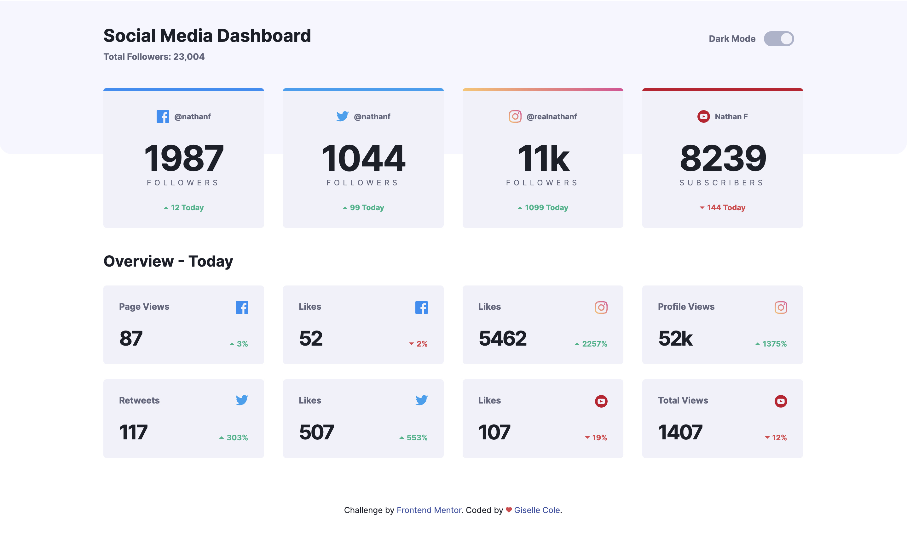
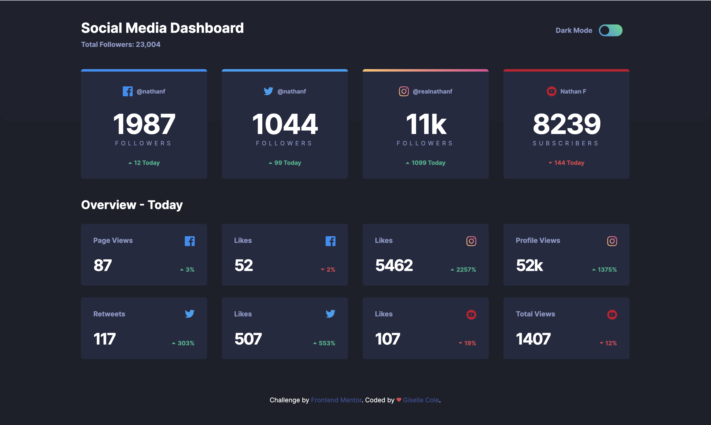
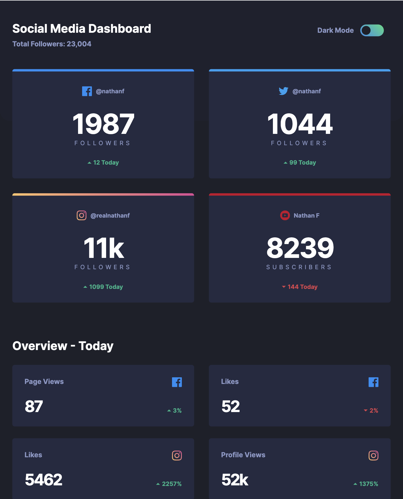
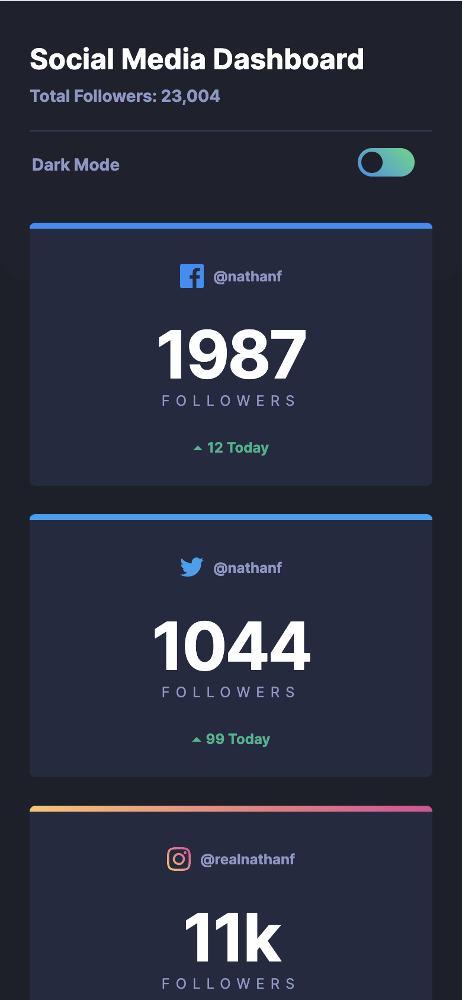

# Frontend Mentor - Social media dashboard with theme switcher solution

This is a solution to the [Social media dashboard with theme switcher challenge on Frontend Mentor](https://www.frontendmentor.io/challenges/social-media-dashboard-with-theme-switcher-6oY8ozp_H). Frontend Mentor challenges help you improve your coding skills by building realistic projects.

## Table of contents

- [Overview](#overview)
  - [The challenge](#the-challenge)
  - [ScreenShot](#screenshot)
  - [Links](#links)
- [My process](#my-process)
  - [Built with](#built-with)
  - [Project Structure](#project-structure)
  - [JavaScript Code: ContentGenerator](#javascript-code-contentgenerator)
  - [JavaScript Code: OverviewGenerator](#javascript-code-overviewgenerator)
  - [What I learned](#what-i-learned)
  - [Continued development](#continued-development)
  - [Dependecies Installed](#dependecies-installed)
  - [Useful resources](#useful-resources)
- [Author](#author)

## Overview

### The challenge

Users should be able to:

- View the optimal layout for the site depending on their device's screen size
- See hover states for all interactive elements on the page
- Toggle color theme to their preference

### ScreenShot

- Deskotp Light Mode
  
- Deskotp Dark Mode
  
- Tablet Dark Mode
  
- Mobile Dark Mode
  

### Links

- Solution URL: [Git-Repo](https://github.com/gisellecole/fem-dashboard-toggle)
- Live Site URL: [Git-Page Live Site](https://gisellecole.github.io/fem-dashboard-toggle/)

## My process

### Built with

- HTML5
- CSS3 (BEM methodology)
- JavaScript
- Flexbox
- CSS Grid
- Mobile-first workflow

### Project Structure

- `index.html`: The main HTML file that renders the social media dashboard.
- `src/css/style.css`: The compiled CSS file from SCSS.
- `src/scss`: Contains the SCSS files for styling the dashboard.
- `src/js/content.js`: Loads the profile content.
- `src/js/overview.js`: Loads the overview.
- `src/js/toggle.js`: Handles the dark/light mode functionality.
- `src/js/script.js`: Loads additional JavaScript scripts.

### JavaScript Code: ContentGenerator

The JavaScript code in this project is responsible for dynamically generating the profile content cards based on the data provided. It utilizes the ES6+ syntax and modern DOM manipulation techniques.

The `ContentGenerator` class defined in `src/js/content.js` has the following features:

- The `profiles` property is an object that stores data for generating content cards. Each property within `profiles` represents a profile and contains an array of values related to that profile.
- The `getProfileFormat` method generates an individual content card by creating a `div` element and setting its HTML content based on the provided data.
- The `setPageContent` method sets the content of the profiles section by iterating over the `profiles` object and calling `getProfileFormat` to generate each profile card.

To use this code, an instance of the `ContentGenerator` class is created, and the `setPageContent` method is called to generate and display the content cards.

**Note:** The JavaScript code is designed to be executed within a web browser environment and interacts with the DOM using methods such as `document.createElement` and `appendChild`. It is intended to be executed within a web browser environment.

## JavaScript Code: OverviewGenerator

The JavaScript code in this project is responsible for dynamically generating the overview cards based on the provided data. It utilizes modern JavaScript (ES6+) syntax and interacts with the DOM to create and manipulate elements.

The `OverviewGenerator` class defined in `src/js/overview.js` offers the following functionality:

- The `overviewData` property is an object that stores data for generating the overview cards. Each property within `overviewData` represents an overview card and contains an array of values related to that card.
- The `getOverviewCard` method generates an individual overview card by creating a `div` element and setting its HTML content based on the provided data. Destructuring assignment is used to extract the values from the object passed as an argument.
- The `setOverviewsContent` method sets the content of the overview section by iterating over the `overviewData` object, calling `getOverviewCard` for each entry, and appending the generated cards to the `overviewList` element.

To use this code, an instance of the `OverviewGenerator` class should be created, and the `setOverviewsContent` method should be called to generate and display the overview cards.

**Note:** The JavaScript code interacts with the Document Object Model (DOM) using methods such as `document.createElement` and `appendChild`. It is intended to be executed within a web browser environment.

### What I learned

I learned a lot while working on this project, including:

- How to use CSS custom properties to create a theme switcher
- How to use the `background-blend-mode` property to blend two backgrounds together
- How to use CSS Grid to create a responsive layout
- How to use the `prefers-color-scheme` media query to detect the user's preferred color scheme
- How to use the `transition` property to create smooth animations
- How to use the `transform` property to rotate elements
- How to use the `filter` property to create a dark overlay on an image
- How to use the `::before` pseudo-element to create a custom checkbox
- How to use JavaScript to toggle classes on elements
- And much more!

### Continued development

I want to continue focusing on learning more about JavaScript and its various APIs. I also want to continue improving my CSS skills, especially with regards to layout and animation.

### Dependecies Installed

- first: `npm install gulp-cli -g`
- then: `npm init -y `
- to create package.json: `npm install  @babel/core @babel/preset-env postcss autoprefixer browser-sync cssnano dart-sass gulp gulp-babel gulp-postcss gulp-sass gulp-terser `
- install sass: `npm install sass`
- install gulp-sass: `npm install gulp-sass --save-dev`

### Useful resources

- [What HTML markup (accessible) ](https://scottaohara.github.io/a11y_styled_form_controls/src/radio-button--switch/).
- [Switching between light/dark modes via JS and Prefers-color-scheme media query](https://piccalil.li/tutorial/create-a-user-controlled-dark-or-light-mode/).
- [Inclusive Components book ](https://inclusive-components.design/cards/).

## Author

- Website - [Giselle Cole](https://www.your-site.com)
- Frontend Mentor - [@gisellecole](https://www.frontendmentor.io/profile/gisellecole)
